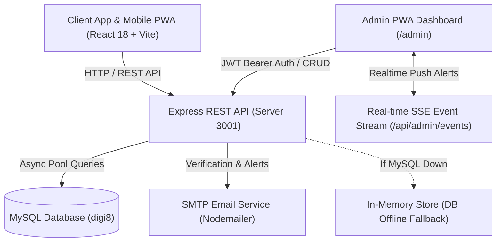

# 🚀 Digi-8 Solutions — Complete Project Blueprint & Architecture Map

> **AUTOMATIC MAINTAINER NOTE**: This document represents the single source of truth for the project architecture, file structure, database schemas, and API blueprints for **Digi-8 Solutions**. It MUST be updated whenever any addition, modification, or structural change is made to the codebase.

---

## 📅 Last Updated: 2026-08-16 (Favicon 3D SVG, Global Search Modal, Chatbot Ticket Engine & Support Desk)

---

## 📌 1. Project Overview & Technology Stack

**Digi-8 Solutions** is an enterprise-grade full-stack B2B digital transformation & technology services platform with Progressive Web App (PWA) installation capabilities, global visitor search, interactive AI chatbot support ticket system, and real-time SSE push alerts.

- **Frontend**: React 18, TypeScript, Vite 5 (configured with `host: true` & `port: 5173`), React Router v6, Tailwind CSS v3, Framer Motion, Lucide React.
- **Favicon & PWA**: 3D Infinity-8 Cyan Gradient SVG Favicon, Web App Manifest (`manifest.json`), Service Worker (`sw.js`), Mobile Meta Tags, Auto-Install Prompt (`PWAInstallPrompt.tsx`).
- **Global Search**: Modal Search Engine (`GlobalSearchModal.tsx`) searching all 8 service divisions, tech stack, portfolio, and pages with `Ctrl+K` keyboard shortcut.
- **Automated Ticket System**: Interactive Chatbot (`AIChatAssistant.tsx`) with ticket generation flow. Saves to `support_tickets` database, triggers real-time SSE notifications (`NEW_TICKET`), and provides dedicated Admin Support Desk (`AdminTickets.tsx`).
- **Design System**: Executive Royal Sapphire & Vibrant Cyan Enterprise B2B Aesthetic (`#0f172a`, `#00e5ff`, `#1e293b`).
- **Backend API**: Node.js, Express, TypeScript (`tsx` runner), MySQL (`mysql2/promise` with connection pooling & offline fallback store).
- **Real-Time Push Alerts**: Server-Sent Events (SSE) stream (`/api/admin/events`) broadcasting live Lead, Quote, Ticket, Contact, and Newsletter events to connected Admin Web & PWA apps.
- **Authentication**: JWT (JSON Web Tokens) with Bearer headers & Bcrypt password hashing. Admin credentials configurable via `ADMIN_EMAIL` and `ADMIN_PASSWORD` env variables.
- **Notifications**: SMTP via Nodemailer with automated verification tokens and instant admin notifications.

---

## 📐 2. System Architecture Diagram



---

## 📂 3. Complete Directory & File Structure

```
digi-8-solutions-main/
├── .env                              # Client Environment Config (VITE_API_URL)
├── .env.example                      # Client Environment Variables Template
├── eslint.config.js                  # ESLint Linting Configuration
├── index.html                        # Main HTML Document, PWA Meta Tags & SW Registration
├── package.json                      # Frontend NPM Dependencies & Scripts
├── postcss.config.js                 # PostCSS Pipeline Setup
├── tailwind.config.js                # Custom Colors & Animations
├── tsconfig.json                     # Root TypeScript Configuration
├── tsconfig.app.json                 # Client Application TS Configuration
├── tsconfig.node.json                # Node/Vite TS Configuration
├── vite.config.ts                    # Vite Build Engine Configuration (Host: true, Port: 5173)
├── deploy.sh                         # Production VPS Deployment Script
├── PROJECT_BLUEPRINT.md              # Project Blueprint (This File)
│
├── public/                           # Static Assets & PWA Engine
│   ├── favicon.svg                   # Vector Brand Icon
│   ├── logo.png                      # High-res Brand Logo
│   ├── manifest.json                 # PWA Web App Manifest for Mobile App Installation
│   ├── sw.js                         # PWA Service Worker (Caching & Native Push Listener)
│   ├── robots.txt                    # Search Engine Crawler Directives
│   └── sitemap.xml                   # XML Sitemap
│
├── server/                           # Express Backend Server
│   ├── .env                          # Backend Secrets (DB Host, ADMIN_EMAIL, JWT, SMTP)
│   ├── .env.example                  # Backend Environment Template
│   ├── package.json                  # Express Server Dependencies & Scripts
│   ├── tsconfig.json                 # Backend TypeScript Settings
│   └── src/
│       ├── db.ts                     # MySQL Pool, Auto Schemas & Configurable Admin Seeding
│       ├── emailService.ts           # SMTP Email Transport & Notifications
│       └── index.ts                  # Express Routes, Auth, Realtime SSE & CRUD API
│
└── src/                              # Frontend React Source Code
    ├── main.tsx                      # React DOM Rendering Entry Point
    ├── App.tsx                       # Main Routing Engine, Auth Guards & PWA Prompt Mount
    ├── index.css                     # Global Tailwind Styles & Design Tokens
    │
    ├── components/                   # Core & Shared Components
    │   ├── AIAssistant.tsx           # Floating AI Interactive Widget
    │   ├── AIChatAssistant.tsx       # AI Modal Chat Drawer with Support Ticket Creation
    │   ├── AnimatedCounter.tsx       # Counter Animation Component
    │   ├── BootScreen.tsx            # Initial Page Preloader
    │   ├── BusinessScanner.tsx       # Interactive Business Audit Scanner
    │   ├── CustomCursor.tsx          # Micro-interactive Mouse Cursor
    │   ├── DigitalTransformationJourney.tsx # Interactive Roadmap Visualizer
    │   ├── Footer.tsx                # Corporate Footer
    │   ├── GlobalSearchModal.tsx     # Visitor Search Engine with Ctrl+K Listener
    │   ├── LeadGenForm.tsx           # Conversion & Lead Generation Form
    │   ├── Navbar.tsx                # Dynamic B2B Header Navigation with Search Trigger
    │   ├── PackageBuilder.tsx        # Custom Service Package Builder
    │   ├── ParticleBackground.tsx    # Interactive Canvas Background
    │   ├── PWAInstallPrompt.tsx      # Mobile PWA 1-Click App Install Prompt
    │   ├── RevealOnScroll.tsx        # Motion Scroll Reveal Animation
    │   ├── SEOHead.tsx               # Dynamic Meta Tag Injector
    │   ├── ScrollProgress.tsx        # Top Reading Progress Bar
    │   ├── ServiceContactForm.tsx    # Service-Specific Inquiry Form
    │   └── home/                     # Homepage Specialized Sections
    │       ├── BusinessProblems.tsx  # Industry Pain Points Grid
    │       ├── HomeStyles.css        # Hero & Home Keyframe Animations
    │       ├── OurServices.tsx       # Core Services Grid
    │       ├── SolarSystemHero.tsx   # Interactive Hero Section Visualizer
    │       ├── TestimonialsSlider.tsx # Dynamic Client Reviews Slider
    │       ├── TrustAndProcess.tsx   # Enterprise Delivery Process
    │       ├── WhyChooseUs.tsx       # Metric Badges & Competitive Edge
    │       └── WhyDigi8.tsx          # Brand Value Proposition Section
    │
    ├── data/                         # Datasets & Metadata
    │   └── servicesData.ts           # Comprehensive Service Descriptions
    │
    ├── lib/                          # Client API Utilities & Config
    │   ├── api.ts                    # API Client, Ticket Endpoints, Auth & Supabase Compatibility
    │   ├── config.ts                 # Application Config Constants
    │   ├── reportEngine.ts           # Audit Scanner PDF/Report Generator
    │   └── supabase.ts               # Database Client Strategy
    │
    └── pages/                        # Page Router Views
        ├── About.tsx                 # About Digi-8 Solutions
        ├── Blog.tsx                  # Technical Articles List
        ├── BlogPost.tsx              # Article Detailed View
        ├── Careers.tsx               # Career Opportunities Page
        ├── CaseStudies.tsx           # Enterprise Case Studies Showcase
        ├── Contact.tsx               # Contact Information & Map Form
        ├── FAQ.tsx                   # Frequently Asked Questions
        ├── Home.tsx                  # Main Landing Page
        ├── Industries.tsx            # Industry Verticals Breakdown
        ├── NotFound.tsx              # 404 Error Page
        ├── Portfolio.tsx             # Project Showcase Gallery
        ├── Pricing.tsx               # Service Pricing Plans Matrix
        ├── Privacy.tsx               # Privacy Policy
        ├── QuoteCalculator.tsx       # Instant Cost Estimator Tool
        ├── ServicePage.tsx           # Generic Service Router Page
        ├── Services.tsx              # Service Catalog Directory
        ├── Technologies.tsx          # Technology Stack & Infrastructure
        ├── Terms.tsx                 # Terms of Service
        ├── Testimonials.tsx          # Full Client Testimonials Page
        ├── VerifyEmail.tsx           # Token Verification Page
        │
        ├── admin/                    # Administrative Control Panel
        │   ├── AdminBlog.tsx         # Article CMS Editor
        │   ├── AdminContacts.tsx     # Contact Submissions List
        │   ├── AdminDashboard.tsx    # System Analytics Overview
        │   ├── AdminLayout.tsx       # Realtime SSE Alerts & Admin Navigation
        │   ├── AdminLeads.tsx        # Qualified Lead Tracker
        │   ├── AdminLogin.tsx        # Secured Admin Login Portal
        │   ├── AdminPricing.tsx      # Pricing Package CMS
        │   ├── AdminProjects.tsx     # Portfolio Project Manager
        │   ├── AdminQuotes.tsx       # Quote Submissions Manager
        │   ├── AdminTestimonials.tsx # Testimonial Review CMS
        │   ├── AdminTickets.tsx      # Support Ticket Desk & Real-time Update System
        │   ├── AdminUsers.tsx        # Admin User Management
        │   ├── ForgotPassword.tsx    # Password Reset Request Page
        │   └── ResetPassword.tsx     # Password Update Form
        │
        └── services/                 # Dedicated Service Division Pages
            ├── AITraining.tsx
            ├── Branding.tsx
            ├── BrandingIdentity.tsx
            ├── BusinessRegistration.tsx
            ├── CorporateGifting.tsx
            ├── CustomizedGifting.tsx
            ├── CyberSecurity.tsx
            ├── CyberSecurityCloud.tsx
            ├── DigitalMarketing.tsx
            ├── DigitalMarketingGrowth.tsx
            ├── DigitalPrinting.tsx
            ├── MobileApp.tsx
            ├── StartupGuidance.tsx
            ├── TechnologyInfrastructure.tsx
            ├── WebDevelopment.tsx
            └── WorkforceSupport.tsx
```

---

## 🛠 4. Local Execution Instructions

To run the platform live on your system:
```bash
npm run dev
```
- Open your browser at `http://localhost:5173` (or `http://127.0.0.1:5173`).
